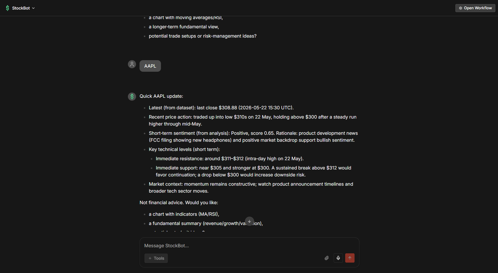
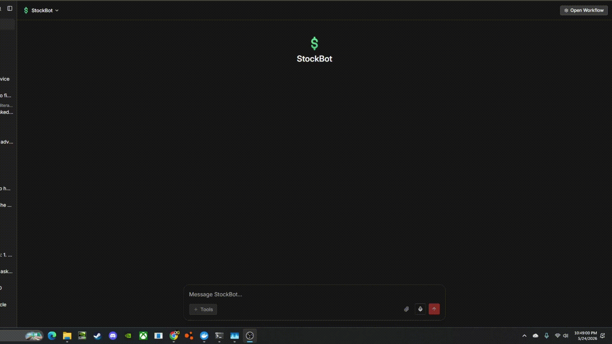

# n8n StockBot — AI-Powered Short‑Term Sentiment Workflows

A compact set of n8n workflows that implement an AI assistant for short-term stock sentiment. The flows fetch market data (Twelve Data), aggregate recent news (NewsAPI), and orchestrate an LLM to produce structured short-horizon sentiment summaries. This project showcases API integration, data cleaning, LLM chaining, and practical automation patterns in n8n. This project is primarily a proof of concept, seeing how an LLM would utilize market data to explore how an LLM can summarize market/news sentiment for educational purposes. This sepcific version of the bot runs on OpenAi's ChatGPT but it is not complecated to swap models to the users prefered LLM, Local Ollama models can provide good market analysis, this project was switched to OpenAi's models to provide faster and more coherent responses. 

---

## Contents
- Overview
- Features
- How it works (architecture)
- Directory layout
- Prerequisites
- Quick start
- Configuration
- Usage
- Production recommendations
- Security and cost
- Troubleshooting
- License

---

 

---
## Important disclaimer — Not financial advice
This project is provided for demonstration and educational purposes only. It is NOT financial, investment, tax, or legal advice. AI outputs may be incomplete, incorrect, or out of date. Do not make real investment decisions based solely on these workflows. Always do your own research and consult a licensed professional.  
If you expose these tools to other users, display a visible notice that the assistant is not a licensed financial advisor.

---

## Features
- Multi-API integration in n8n (Twelve Data, NewsAPI).
- LLM-orchestrated analysis using LangChain/OpenAI nodes.
- Basic data cleaning and normalization of time series and article content.
- Chat-style agent that invokes a tool workflow and maintains short-term context.
- Portfolio-ready hygiene: sanitized exports, .env usage, and clear setup guidance.

---

## How it works
At a basic level:
1. Input: User provides a stock ticker (e.g., AAPL).
2. Market data: Fetch recent time-series data from Twelve Data.
3. News: Pull the latest relevant articles via NewsAPI.
4. Processing: Normalize, trim, and prepare inputs for the LLM.
5. LLM analysis: Summarize near-term sentiment and rationale in a structured format (JSON).
6. Output: Return a concise, explainable assessment suitable for dashboards or chat responses.

The most practical use of this project is as a stock market chatbot, if you're already intrested in stocks, it can be a useful consultant/tool to help quickly gather information and sentiment of a certain stock.  Can be provided stock tickers and provide surface level analysis or you could take advantage of a bigger Ai model to turn it into an LLM chatbot with more market insight than a base LLM running on its own.

Workflows:
- StockBot.json — Orchestrates the conversation and tool invocation.
- analyze_stock.json — Agent tool used to fetch data, prepare context, and perform LLM-based sentiment analysis.  Can be built into a stand-alone Ai agent but this flow worked best for my goals of a stock chat bot

---

## Directory layout
- workflows/
  - StockBot.json
  - analyze_stock.json
- tests/
  - example_input.json
  - example_output.json
- assets/
  - Demo.gif
  - Demo.png
- .env.example
- .gitignore
- LICENSE (MIT)
- README.md (this file)

---

## Prerequisites
- n8n (self-hosted or n8n Cloud). Recommended: n8n ≥ 0.230.0.
- API keys / accounts:
  - LLM (OpenAI, Gemini, Grok, Ollama, etc.)
  - Twelve Data
  - NewsAPI
- Familiarity with importing workflows into n8n and assigning credentials.

---

## Quick start

1) Clone the repository
```
git clone https://github.com/rdunlap514/n8nStockBot.git
cd n8nStockBot
```

(Optional) Create a .env file  
Copy .env.example to .env and add your keys if you plan to reference env vars within n8n:
```
cp .env.example .env
# then edit .env and add:
# OPENAI_API_KEY=...
# TWELVEDATA_API_KEY=...
# NEWSAPI_KEY=...
```

2) Create credentials in n8n (recommended)  
Using n8n Credentials is safer than hardcoding secrets.
- In n8n: Credentials → Create
  - OpenAI / OpenAI API
  - HTTP / Generic credentials (or custom credentials for Twelve Data / NewsAPI)

3) Import the workflows
- n8n → Workflows → Create Workflow → Import from File → Choose file → select:
  - workflows/StockBot.json
  - workflows/analyze_stock.json
- After import, open each workflow and assign the appropriate credentials to:
  - LLM nodes (OpenAI/LangChain)
  - HTTP Request nodes (Twelve Data, NewsAPI)

4) Re-link the tool workflow
- Open the StockBot workflow.
- Locate the node that calls the analyze_stock workflow.
- Use the workflow dropdown to select your imported analyze_stock workflow.  
This prevents issues with stale workflow IDs after import.

5) Test a run
- In n8n, run StockBot manually and provide a test ticker (e.g., AAPL).
- Review the execution data to confirm market/news fetches and the LLM summary.

---



---

## Configuration

Environment variables (optional, for reference within n8n or your runtime):
- OPENAI_API_KEY
- TWELVEDATA_API_KEY
- NEWSAPI_KEY

n8n credentials (preferred in production):
- Map each node to the appropriate credential entry created in n8n.

LLM configuration:
- Use the OpenAI node or LangChain nodes for your chosen provider.
- Consider temperature and token limits appropriate to cost and latency targets.

Rate limits and retries:
- Twelve Data and NewsAPI enforce rate limits. Add backoff/retry logic on HTTP nodes where appropriate.

---

## Usage

- Chat-driven: Interact with the StockBot workflow to request a ticker analysis.
- Tool invocation: The agent calls analyze_stock to fetch data and produce the structured summary.
- Output: A short-term sentiment assessment with rationale in JSON-like structure suitable for downstream consumption.

Demos:
- See assets/Demo.gif or assets/Demo.png for a quick visual of the flow.

---

## Production recommendations - This is a proof of conecpt and can be improved upon

Error handling & validation
- Add IF nodes to check HTTP status codes and payloads.
- Validate/parse LLM JSON in a Code node; add a retry with a stricter prompt on parse failure.
- Implement retry/backoff for transient API failures.

Cost and performance
- Limit article count and trim/summarize article bodies before the LLM step.
- Cap token usage and control temperature for predictability.

Modularity
- Split logic into smaller flows for clarity and reuse (e.g., get_market_data, get_news, analyze_sentiment).

---

## Security and cost
- Do not commit real API keys; keep .env in .gitignore.
- Carefully review any proprietary or personal data before sending to third-party LLMs.
- Monitor and respect API rate limits (Twelve Data, NewsAPI) and add exponential backoff as needed.
- Trim long texts before LLM calls to control spend.

---

## Troubleshooting
- Agent doesn’t call the tool
  - Re-open the tool node in StockBot and re-select the analyze_stock workflow.
- HTTP requests fail
  - Verify API keys, quotas, and rate limits. Inspect raw responses in n8n execution logs.
- LLM returns malformed JSON
  - Tighten the prompt. Add a post-LLM parsing/validation step with a retry path.

---

## License
MIT — see LICENSE for details.
